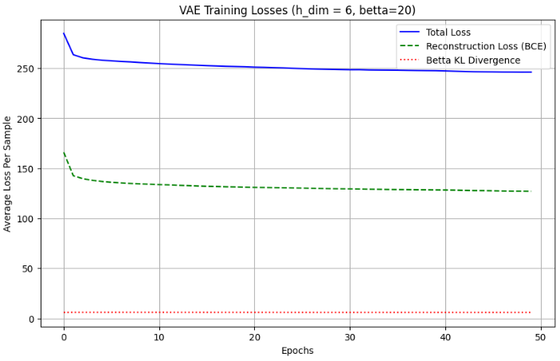

# Homework 1: Probabilistic Graphical Models & Variational Autoencoders

[](https://github.com/alirezanmotiei/Deep-Generative-Models)
[-orange.svg)](https://github.com/alirezanmotiei/Deep-Generative-Models)
[](report/HW01-Report.pdf)

> **Instructor**: Dr. Mostafa Tavassolipour  
> **Student**: Alireza Najafi Motiei (ID: `810100224`)  
> **Institution**: Faculty of Electrical & Computer Engineering, University of Tehran

---

## 📌 Overview

This assignment covers foundational graphical modeling and latent variable representation learning:
1. **Probabilistic Graphical Models (PGM)**:
   - Bayesian network conditional independence queries via **d-separation**.
   - **Markov Blankets** ($\text{MB}(X) = \text{Parents}(X) \cup \text{Children}(X) \cup \text{Co-parents}(X)$).
   - Moralization into **Markov Random Fields (MRFs)**, **I-Map** fidelity, and **Chordal graph** analysis.
   - Gibbs distribution clique factorizations with partition function $Z$.
2. **Variational Autoencoders (VAE)**:
   - **ELBO (Evidence Lower Bound)** derivation and optimization dynamics.
   - **Reparameterization Trick** ($z = \mu + \sigma \odot \epsilon$) for gradient backpropagation.
   - **$\beta$-VAE** on the **dSprites** dataset ($64 \times 64$ binary shapes) across $\beta \in \{1, 2, 20\}$.
   - Disentanglement evaluation via **Mutual Information Gap (MIG)** and empirical demonstration of **posterior collapse**.
   - In-depth theoretical study of **VQ-VAE**, **VampPrior**, and **SC-VAE (Sparse Coding VAE with Learned ISTA)**.

---

## 🧪 Key Results & Visualizations

### 1. VAE Reconstructions on dSprites ($\beta=1$)
The baseline model achieves strong shape and spatial reconstruction fidelity with characteristic pixel-level smoothing:

<p align="center">
  
</p>

### 2. Disentanglement Analysis ($\beta$-VAE)
Comparing factor disentanglement across $\beta=1$, $\beta=2$, and $\beta=20$:

| Model Configuration | Reconstruction Fidelity | Disentanglement (MIG) | Latent Capacity |
|:---:|:---:|:---:|:---:|
| **$\beta = 1$ (Baseline)** | Sharp boundaries, fine details | Entangled representation | Full utilization |
| **$\beta = 2$ (Optimal)** | Minor boundary blurring | Disentangled spatial coordinates | Balanced capacity |
| **$\beta = 20$ (Over-regularized)** | Severe blur, generic mean | Vanishing informativeness | **Posterior Collapse** ($q_\phi(z \mid x) \to p(z)$) |

<p align="center">
  
  <br/>
  <em>Mutual Information Gap (MIG) comparison showing latent factor independence across generative attributes.</em>
</p>

---

## 📂 Directory Structure

```text
HW01-PGM-and-VAE/
├── README.md                          # Assignment overview and results
├── notebooks/
│   └── DGM_HW01.ipynb                 # Complete implementation with all preserved outputs
└── report/
    ├── HW01_Report.tex                # Academic English LaTeX source (IEEEtran)
    ├── HW01-Report.pdf                # Original course submission report (Persian)
    └── figures/                       # Extracted high-resolution figures (16 assets)
```

---

## 🚀 How to Run

1. Navigate to the notebooks directory:
   ```bash
   cd HW01-PGM-and-VAE/notebooks
   ```
2. Open in Jupyter or VS Code:
   ```bash
   jupyter notebook DGM_HW01.ipynb
   ```
3. Dataset: The notebook uses `dsprites_ndarray_co1sh3sc6or40x32y32_64x64.npz` available from the [official dSprites repository](https://github.com/google-deepmind/dsprites-dataset).
