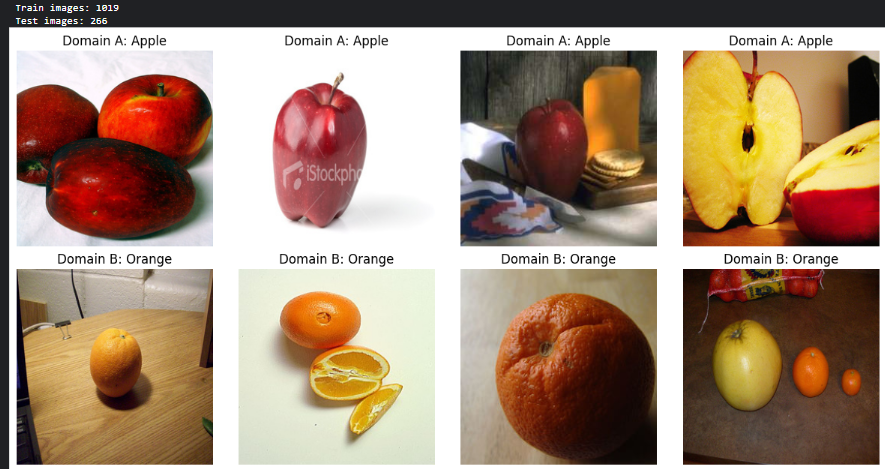
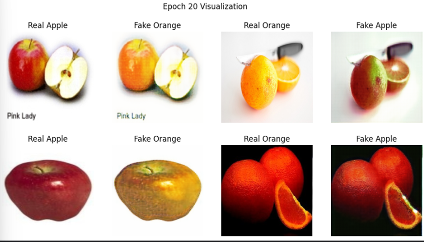
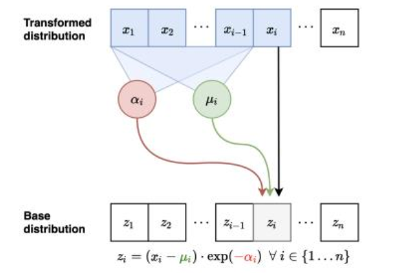

# Homework 2: Normalizing Flows & Unpaired Translation with CycleGAN

[](https://github.com/alirezanmotiei/Deep-Generative-Models)
[-orange.svg)](https://github.com/alirezanmotiei/Deep-Generative-Models)
[](report/HW02-Report.pdf)

> **Instructor**: Dr. Mostafa Tavassolipour  
> **Student**: Alireza Najafi Motiei (ID: `810100224`)  
> **Institution**: Faculty of Electrical & Computer Engineering, University of Tehran

---

## 📌 Overview

This assignment focuses on exact-likelihood generative models and unpaired image-to-image translation:
1. **Normalizing Flows (NFs)**:
   - **MADE (Masked Autoencoder for Distribution Estimation)**: Preserving the autoregressive property in feedforward dense networks via degree-based connectivity masking.
   - **MAF (Masked Autoregressive Flow)**: Affine flow parameterization with triangular Jacobian log-determinant computation.
   - **MAF vs. IAF Duality**: Parallel training ($756.81\text{ s}$) vs. sequential sampling ($1995.75\text{ s}$) in MAF, and the inverted trade-off in IAF.
   - **Unsupervised Anomaly Detection**: Evaluation of exact log-likelihood anomaly scores ($-\log p(x)$), achieving **$\text{AUROC} = 0.73$**.
2. **CycleGAN (Unpaired Image-to-Image Translation)**:
   - Theoretical necessity of the **Cycle-Consistency Loss** ($\mathcal{L}_{\text{cyc}}$) to prevent mode collapse.
   - **Identity Mapping Regularization** ($\mathcal{L}_{\text{id}}$) for background color and scene composition preservation.
   - Architectural design: **ResNet generator with residual bottleneck** vs. **U-Net**, **70$\times$70 PatchGAN** discriminator, and **historical image replay buffer** (50 images).
   - Experiments on **Horse2Zebra** and **Apple2Orange** benchmarks.

---

## 🧪 Key Results & Visualizations

### 1. CycleGAN: Horse $\leftrightarrow$ Zebra
The model learns to translate between horses and zebras while preserving animal pose and background scenery:

<p align="center">
  
  <br/>
  <em>Input samples (left), synthesized cross-domain translations (center), and cyclic reconstructions (right).</em>
</p>

### 2. CycleGAN: Apple $\leftrightarrow$ Orange (With Identity Loss $\lambda_{\text{id}} = 5$)
Enforcing the identity mapping loss prevents spurious background color modifications while altering fruit color and texture:

<p align="center">
  
  <br/>
  <em>Apple-to-orange and orange-to-apple translations demonstrating texture and color adaptation with background preservation.</em>
</p>

### 3. Normalizing Flow Anomaly Detection ($\text{AUROC} = 0.73$)
Evaluating out-of-distribution detection using exact negative log-likelihood scores:

<p align="center">
  
</p>

---

## 📂 Directory Structure

```text
HW02-Flows-and-CycleGAN/
├── README.md                          # Assignment overview and results
├── notebooks/
│   ├── DGM-HW02-1.ipynb               # Normalizing Flows (MADE, MAF, Anomaly Detection)
│   └── DGM-HW02-2.ipynb               # CycleGAN (Horse2Zebra and Apple2Orange)
└── report/
    ├── HW02_Report.tex                # Academic English LaTeX source (IEEEtran)
    ├── HW02-Report.pdf                # Original course submission report (Persian)
    └── figures/                       # Extracted high-resolution figures (35 assets)
```

---

## 🚀 How to Run

1. **Normalizing Flows**:
   ```bash
   jupyter notebook notebooks/DGM-HW02-1.ipynb
   ```
2. **CycleGAN**:
   ```bash
   jupyter notebook notebooks/DGM-HW02-2.ipynb
   ```
3. Datasets:
   - `horse2zebra` and `apple2orange` can be downloaded via standard CycleGAN scripts:
     ```bash
     bash download_cyclegan_dataset.sh horse2zebra
     bash download_cyclegan_dataset.sh apple2orange
     ```
