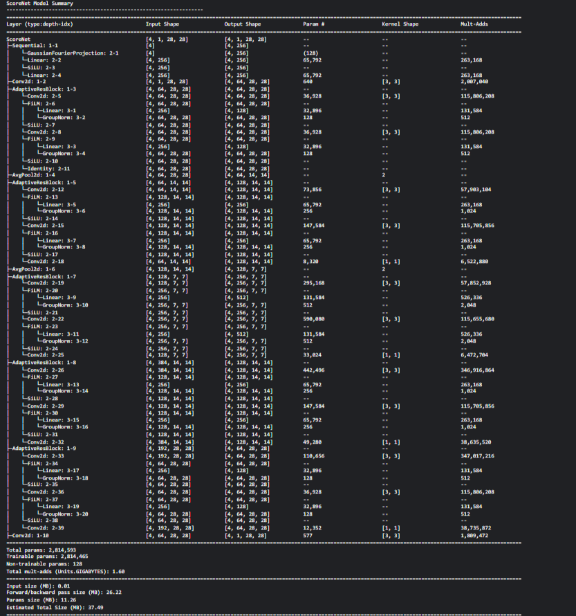
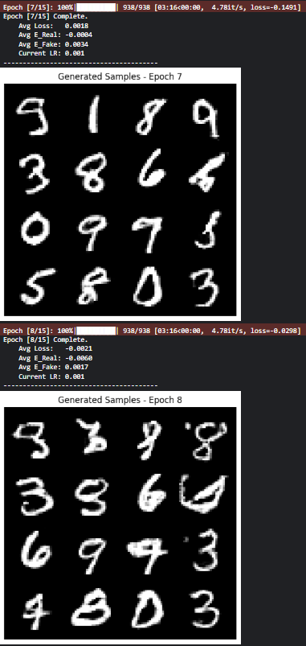
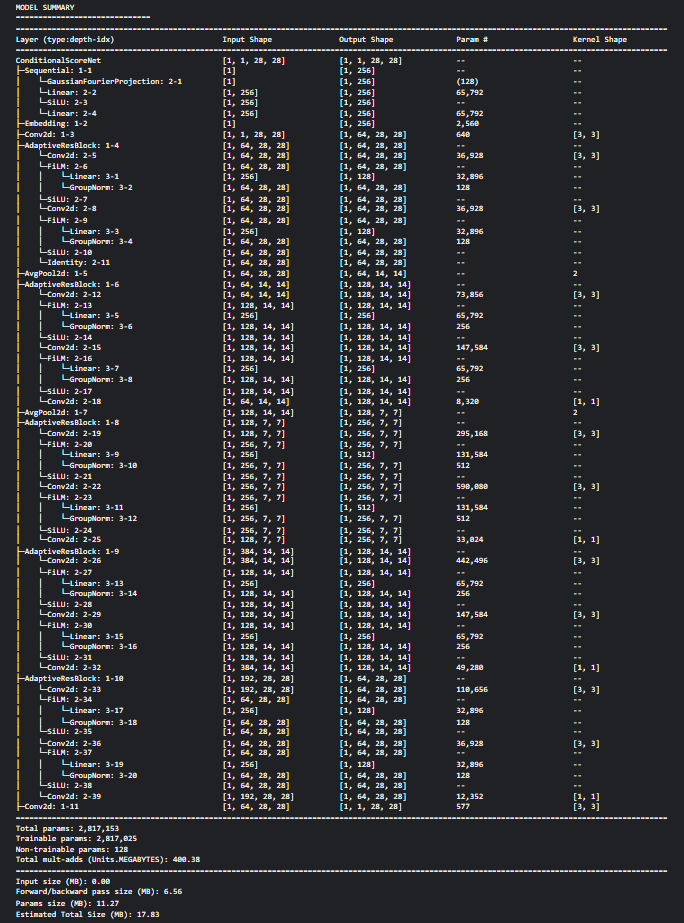

# Homework 3: Energy-Based Models & Score-Based Generative Modeling with FiLM

[](https://github.com/alirezanmotiei/Deep-Generative-Models)
[-orange.svg)](https://github.com/alirezanmotiei/Deep-Generative-Models)
[](report/HW03-report.pdf)

> **Instructor**: Dr. Mostafa Tavassolipour  
> **Student**: Alireza Najafi Motiei (ID: `810100224`)  
> **Institution**: Faculty of Electrical & Computer Engineering, University of Tehran

---

## 📌 Overview

This assignment covers unnormalized density modeling and gradient-based generative frameworks:
1. **Energy-Based Models (EBM)**:
   - Partition function $Z(\theta) = \int e^{-E_\theta(x)} dx$ and intractability of high-dimensional integration.
   - Analysis of **Maximum Likelihood learning gradients** (positive data attraction vs. negative model fantasy suppression).
   - **Contrastive Divergence (CD)** with truncated MCMC.
   - Proof of rejection sampling exponential decay in high dimensions ($D=784 \implies P(\text{accept}) \approx 4 \times 10^{-4}$).
   - Implementation of deep convolutional EBM on MNIST, evaluating **Langevin Dynamics** for synthesis and denoising across $\sigma \in \{0.2, 0.4, 0.6\}$.
2. **Score-Based Generative Models (SGM)**:
   - Mathematical independence of the **Score Function** $s_\theta(x) = \nabla_x \log p_\theta(x)$ from the partition function $Z$.
   - **Denoising Score Matching (DSM)**: Circumventing the $\mathcal{O}(D)$ computational bottleneck of the Jacobian trace.
   - Analysis of single-scale score matching pathologies: the **Manifold Hypothesis**, **Global Weight Blindness**, and **Lack of Mode Mixing**.
   - **NCSN (Noise Conditional Score Networks)** and **Annealed Langevin Dynamics** over geometric noise schedules $\{\sigma_i\}_{i=1}^L$.
   - Conditional generation via **FiLM (Feature-wise Linear Modulation)** mechanism ($\text{FiLM}(h) = \gamma(y) \odot h + \beta(y)$).

---

## 🧪 Key Results & Visualizations

### 1. Vector Fields & Score Trajectories
Vector fields illustrating learned score gradients guiding noisy particles toward data modes:

<p align="center">
  
</p>

### 2. Denoising via Langevin Dynamics on MNIST
Evaluating iterative Langevin restoration across multiple corruption scales ($\sigma=0.2, 0.4, 0.6$):

<p align="center">
  
  <br/>
  <em>Denoising progression at heavy corruption ($\sigma = 0.6$), illustrating clean digit reconstruction and background clearance.</em>
</p>

### 3. Sampling Evolution in Annealed Langevin Dynamics
Synthesizing structured multi-class samples from pure isotropic noise:

<p align="center">
  
</p>

---

## 📂 Directory Structure

```text
HW03-EBM-and-Score-Based-Models/
├── README.md                          # Assignment overview and results
├── notebooks/
│   ├── DGM-HW3-1.ipynb                # Energy-Based Models & Langevin Dynamics on MNIST
│   └── DGM-HW3-2.ipynb                # Score-Based Generative Models with FiLM Conditioning
└── report/
    ├── HW03_Report.tex                # Academic English LaTeX source (IEEEtran)
    ├── HW03-report.pdf                # Original course submission report (Persian)
    └── figures/                       # Extracted high-resolution figures (29 assets)
```

---

## 🚀 How to Run

1. **Energy-Based Models**:
   ```bash
   jupyter notebook notebooks/DGM-HW3-1.ipynb
   ```
2. **Score-Based Models with FiLM**:
   ```bash
   jupyter notebook notebooks/DGM-HW3-2.ipynb
   ```
3. Environment: Requires PyTorch $\ge 2.0$ with torchvision.
