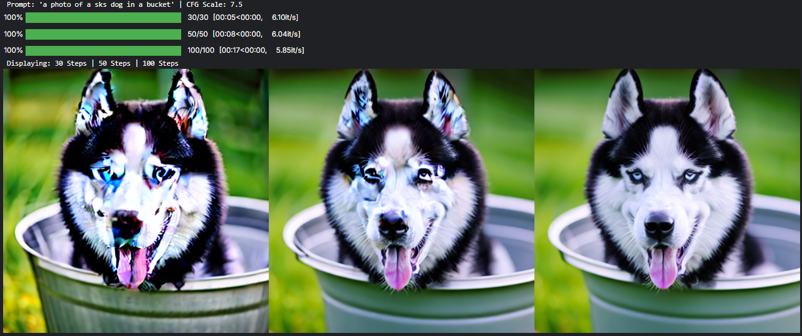
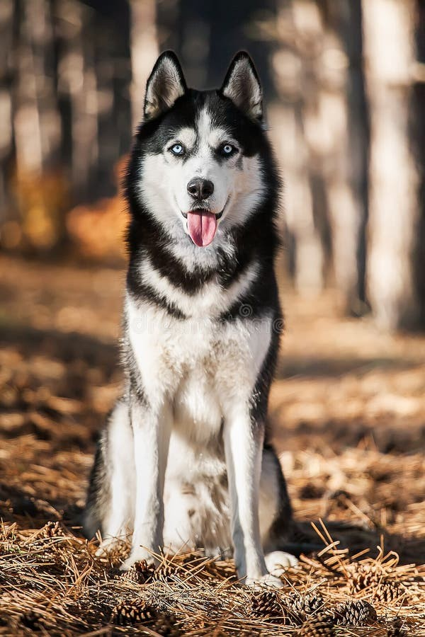
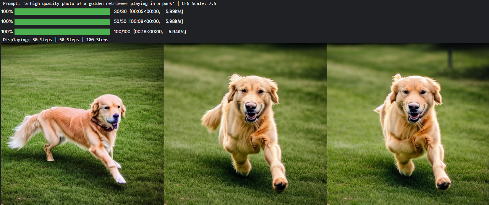

# Homework 4: Diffusion Models, DreamBooth & Continuous Flow Matching

[](https://github.com/alirezanmotiei/Deep-Generative-Models)
[-orange.svg)](https://github.com/alirezanmotiei/Deep-Generative-Models)
[](report/HW04-Report.pdf)

> **Instructor**: Dr. Mostafa Tavassolipour  
> **Student**: Alireza Najafi Motiei (ID: `810100224`)  
> **Institution**: Faculty of Electrical & Computer Engineering, University of Tehran

---

## 📌 Overview

This assignment explores state-of-the-art diffusion frameworks, personalization techniques, and flow matching:
1. **Denoising Diffusion Probabilistic Models (DDPM) & DDIM**:
   - Closed-form forward marginal $q(x_t \mid x_0) = \mathcal{N}(x_t; \sqrt{\bar{\alpha}_t} x_0, (1 - \bar{\alpha}_t) I)$.
   - Advantages of **$\epsilon$-prediction** over direct $x_0$ or $\mu_t$ prediction (target distribution stationarity, gradient stability).
   - Analysis of the **simplified MSE objective** vs. full VLB (downweighting small-$t$ high-frequency details, focusing on coarse structures).
   - **DDIM Deterministic Sampling**: Inversion as discretization of Probability Flow ODEs, achieving a **$50\times$ speedup** over DDPM.
   - **Classifier-Free Guidance (CFG)**: Balances fidelity/contrast against diversity via guidance scale $w$.
2. **DreamBooth Subject Personalization**:
   - Fine-tuning Stable Diffusion with **class-specific prior preservation loss** to avoid language drift and catastrophic forgetting.
   - Parameter-efficient fine-tuning via **LoRA (Low-Rank Adaptation)** on custom Siberian Husky subject photographs.
   - Evaluation across guidance scales $w \in \{5.0, 7.5, 10.0\}$ in diverse contextual prompts.
3. **Continuous Flow Matching (CFM)**:
   - Modeling velocity fields $v_t(x_t)$ along probability paths governed by the **Continuity Equation**.
   - Relationship between the **Probability Flow ODE** in diffusion and Flow Matching.
   - Properties and limitations of **linear probability paths** ($x_t = (1 - t) x_0 + t x_1$) on nonlinear data manifolds.

---

## 🧪 Key Results & Visualizations

### 1. DDPM vs. DDIM Denoising Progression ($50\times$ Accelerated Sampling)
Visualizing reverse denoising trajectories from isotropic Gaussian noise:

<p align="center">
  
  <br/>
  <em>Reverse diffusion denoising trajectories from $t=T$ down to clean sample $t=0$.</em>
</p>

### 2. DreamBooth Subject Personalization (Siberian Husky)
Synthesizing custom subject in novel contextual environments:

<p align="center">
  
  &nbsp;&nbsp;&nbsp;&nbsp;
  
  <br/>
  <em>Left: Training photograph of subject husky. Right: Generated subject across diverse prompts and novel contexts.</em>
</p>

### 3. Classifier-Free Guidance (CFG) Impact
Evaluating the trade-off between prompt alignment and contrast:

| Guidance Scale ($w$) | Perceptual Contrast | Prompt Adherence | Sample Diversity |
|:---:|:---:|:---:|:---:|
| **$w = 5.0$** | Soft, natural tones | Moderate | High diversity |
| **$w = 7.5$ (Optimal)** | Crisp, sharp textures | High adherence | Balanced |
| **$w = 10.0$** | Highly saturated, high contrast | Strict adherence | Reduced diversity |

---

## 📂 Directory Structure

```text
HW04-Diffusion-and-DreamBooth/
├── README.md                          # Assignment overview and results
├── notebooks/
│   ├── HW4-Diffusion-Models.ipynb     # DDPM, DDIM schedulers, training loop & FID
│   ├── HW4-Dreambooth-Assignment.ipynb# DreamBooth fine-tuning on Stable Diffusion
│   └── DGM-HW4-2.ipynb                # Supplementary experiments
└── report/
    ├── HW04_Report.tex                # Academic English LaTeX source (IEEEtran)
    ├── HW04-Report.pdf                # Original course submission report (Persian)
    └── figures/                       # Extracted high-resolution figures (33 assets)
```

---

## 🚀 How to Run

1. **Diffusion Models (DDPM & DDIM)**:
   ```bash
   jupyter notebook notebooks/HW4-Diffusion-Models.ipynb
   ```
2. **DreamBooth Fine-Tuning**:
   ```bash
   jupyter notebook notebooks/HW4-Dreambooth-Assignment.ipynb
   ```
3. Hardware: DreamBooth training requires GPU acceleration ($\ge 12\text{ GB}$ VRAM recommended, e.g. T4/P100 on Kaggle or Google Colab).
