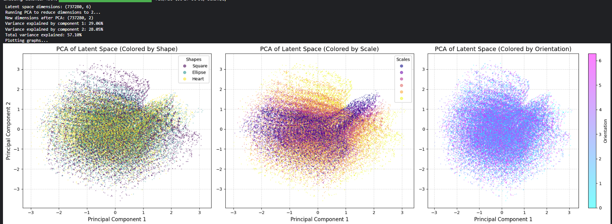

<h1 align="center">Deep Generative Models Portfolio</h1>

<p align="center">
  <strong>Comprehensive Coursework & Implementations in Deep Generative Modeling</strong><br>
  <em>Faculty of Electrical and Computer Engineering, University of Tehran</em><br>
  <strong>Semester:</strong> Fall 1404 (Fall 2025) &nbsp;|&nbsp; <strong>Instructor:</strong> Dr. Mostafa Tavassolipour<br>
  <strong>Author:</strong> Alireza Najafi Motiei (Student ID: <code>810100224</code>)
</p>

<p align="center">
  <a href="https://pytorch.org/"></a>
  <a href="https://huggingface.co/docs/diffusers/"></a>
  <a href="https://python.org/"></a>
  <a href="LICENSE"></a>
  <a href="https://ut.ac.ir/"></a>
</p>

---

## 📖 Executive Summary

This repository contains the complete theoretical research and PyTorch implementations for the graduate-level **Deep Generative Models** course at the **University of Tehran** (Fall 1404 / 2025). The portfolio spans four core paradigms:
1. **Latent Variable Models & PGMs**: Bayesian networks, Markov Random Fields, and Variational Autoencoders ($\beta$-VAE, VQ-VAE, VampPrior, SC-VAE).
2. **Exact-Likelihood & Adversarial Translation**: Autoregressive flows (MADE, MAF, IAF), anomaly detection, and unpaired translation with CycleGAN.
3. **Energy & Score-Based Generative Models**: Contrastive Divergence, Denoising Score Matching, Annealed Langevin Dynamics, and FiLM conditioning.
4. **Diffusion Models & Flow Matching**: DDPM/DDIM schedulers, Classifier-Free Guidance (CFG), DreamBooth subject personalization, and Continuous Flow Matching.

---

## 🎨 Visual Results Gallery

<div align="center">
<table>
  <tr>
    <td align="center" width="50%">
      
      <br><strong>CycleGAN (Horse $\leftrightarrow$ Zebra)</strong>
    </td>
    <td align="center" width="50%">
      
      <br><strong>Diffusion Models (Reverse Denoising Process)</strong>
    </td>
  </tr>
  <tr>
    <td align="center" width="50%">
      
      <br><strong>$\beta$-VAE Disentanglement (dSprites)</strong>
    </td>
    <td align="center" width="50%">
      
      <br><strong>DreamBooth Personalization (Siberian Husky)</strong>
    </td>
  </tr>
</table>
</div>

---

## 📑 Portfolio Overview & Syllabus

| Module | Core Topics | Key Models & Architectures | Datasets | Reports & Sources |
|:---|:---|:---|:---|:---|
| **[HW01](HW01-PGM-and-VAE/)** | Bayesian Networks, d-separation, Markov Blanket, ELBO, $\beta$-VAE, Disentanglement | Standard VAE, $\beta$-VAE, VQ-VAE, VampPrior, SC-VAE | dSprites ($64 \times 64$) | [English LaTeX](HW01-PGM-and-VAE/report/HW01_Report.tex) / [PDF](HW01-PGM-and-VAE/report/HW01-Report.pdf) |
| **[HW02](HW02-Flows-and-CycleGAN/)** | Change-of-Variables, MAF vs. IAF, Anomaly Detection, Unpaired Image Translation | MADE, MAF, CycleGAN (ResNet + 70$\times$70 PatchGAN) | Horse2Zebra, Apple2Orange | [English LaTeX](HW02-Flows-and-CycleGAN/report/HW02_Report.tex) / [PDF](HW02-Flows-and-CycleGAN/report/HW02-Report.pdf) |
| **[HW03](HW03-EBM-and-Score-Based-Models/)** | Energy-Based Models, Contrastive Divergence, Score Matching, Langevin Dynamics | Conv-EBM, NCSN, FiLM conditioning | MNIST ($28 \times 28$) | [English LaTeX](HW03-EBM-and-Score-Based-Models/report/HW03_Report.tex) / [PDF](HW03-EBM-and-Score-Based-Models/report/HW03-report.pdf) |
| **[HW04](HW04-Diffusion-and-DreamBooth/)** | Forward/Reverse SDE/ODE, DDPM vs. DDIM ($50\times$ speedup), CFG, DreamBooth, Flow Matching | DDPM, DDIM, Stable Diffusion + LoRA, Continuous Flow Matching | Custom Husky, Synthetic | [English LaTeX](HW04-Diffusion-and-DreamBooth/report/HW04_Report.tex) / [PDF](HW04-Diffusion-and-DreamBooth/report/HW04-Report.pdf) |

---

## 🔬 Technical Modules Deep-Dive

### Module 1: Probabilistic Graphical Models & Variational Autoencoders
* **Bayesian Networks & d-Separation**: Exact joint distribution factorization, conditional independence proofs via d-separation, Markov blanket delineation ($\text{MB}(T) = \{O, A, M, B\}$), and chordality analysis.
* **$\beta$-VAE Optimization**:
  $$\mathcal{L}_{\beta\text{-VAE}} = \mathbb{E}_{q_\phi(z \mid x)} [\log p_\theta(x \mid z)] - \beta D_{\text{KL}}(q_\phi(z \mid x) \parallel p(z))$$
  Explored the trade-off between reconstruction sharpness and factor disentanglement on dSprites across $\beta \in \{1, 2, 20\}$. Demonstrated the onset of **posterior collapse** at $\beta=20$ where $q_\phi(z \mid x) \to p(z)$ starves latent capacity.
* **Advanced Priors**: Comparative theoretical analysis of **VQ-VAE** (discrete codebooks with STE), **VampPrior** (mixture of pseudo-input posteriors), and **SC-VAE** (Sparse Coding with Learned ISTA).

### Module 2: Normalizing Flows & CycleGAN
* **Autoregressive Flows (MADE & MAF)**: Degree-based masking in feedforward networks ensuring autoregressive tractability. Demonstrated that MAF affords fully parallelized training ($756.81\text{ s}$) while suffering from sequential sampling ($1995.75\text{ s}$), establishing the inverse duality with IAF.
* **Unsupervised Anomaly Detection**: Leveraged exact negative log-likelihood scores ($-\log p(x)$), achieving **$\text{AUROC} = 0.73$**.
* **CycleGAN**:
  $$\mathcal{L} = \mathcal{L}_{\text{GAN}}(G, D_Y) + \mathcal{L}_{\text{GAN}}(F, D_X) + \lambda_{\text{cyc}} \mathcal{L}_{\text{cyc}}(G, F) + \lambda_{\text{id}} \mathcal{L}_{\text{id}}(G, F)$$
  Evaluated on Horse2Zebra and Apple2Orange benchmarks. Demonstrated that the **identity mapping loss** ($\lambda_{\text{id}} = 5$) effectively preserves background context (grass, sky, table surfaces) by penalizing spurious non-target domain modifications.

### Module 3: Energy-Based Models & Score-Based Modeling
* **Partition Function Challenge**: Explored the intractability of $Z(\theta) = \int e^{-E_\theta(x)} dx$ and contrastive divergence ($CD_k$) training. Mathematically demonstrated that rejection sampling in high dimensions ($D=784$) experiences exponential acceptance collapse ($P(\text{accept}) \approx 4 \times 10^{-4}$).
* **Score-Based Modeling**:
  $$s_\theta(x) = \nabla_x \log p_\theta(x) = -\nabla_x E_\theta(x)$$
  Score matching inherently cancels the spatial derivative of $Z(\theta)$. Used **Denoising Score Matching (DSM)** to bypass the expensive $\mathcal{O}(D)$ Jacobian trace.
* **Noise Conditional Score Networks (NCSN) with FiLM**: Implemented geometric noise scheduling $\{\sigma_i\}_{i=1}^L$ with **Annealed Langevin Dynamics** to resolve manifold boundary pathologies, utilizing **FiLM** affine conditioning ($\gamma(y) \odot h + \beta(y)$).

### Module 4: Diffusion Models, DreamBooth & Flow Matching
* **DDPM and Accelerated DDIM**: Closed-form forward marginal:
  $$q(x_t \mid x_0) = \mathcal{N}(x_t; \sqrt{\bar{\alpha}_t} x_0, (1 - \bar{\alpha}_t) I)$$
  Implemented deterministic DDIM sampling ($\eta = 0$) by discretizing the Probability Flow ODE, delivering a **$50\times$ inference speedup** over 1000-step DDPM with high perceptual fidelity.
* **DreamBooth Personalization**: Fine-tuned Stable Diffusion on custom Siberian Husky photographs using class-specific prior preservation loss to prevent language drift, paired with **LoRA (Low-Rank Adaptation)** across Classifier-Free Guidance scales $w \in \{5.0, 7.5, 10.0\}$.
* **Continuous Flow Matching**: Formulated ODE vector field regression $v_t(x_t)$ along linear probability paths $x_t = (1 - t) x_0 + t x_1$, establishing its mathematical equivalence to the Probability Flow ODE in diffusion models.

---

## 🇮🇷 بخش فارسی / Persian Summary

این مخزن شامل پیاده‌سازی‌ها و گزارش‌های تئوری و عملی جامع برای درس **مدل‌های مولد عمیق (Deep Generative Models)** در **دانشکده مهندسی برق و کامپیوتر دانشگاه تهران** برای **نیم‌سال پاییز ۱۴۰۴** تحت نظر **دکتر مصطفی توسلی‌پور** می‌باشد که توسط **علیرضا نجفی مطیعی** (شماره دانشجویی: ۸۱۰۱۰۰۲۲۴) انجام گرفته است:
1. **تکلیف اول (PGM و VAE):** بررسی شبکه‌های بیزی، استقلال شرطی با d-separation، پتو مارکوف، اشتقاق کران پایین شواهد (ELBO)، پیاده‌سازی مدل‌های $\beta$-VAE روی دادگان dSprites، بررسی پدیده Posterior Collapse و تحلیل تئوری مدل‌های VQ-VAE، VampPrior و SC-VAE.
2. **تکلیف دوم (Normalizing Flows و CycleGAN):** پیاده‌سازی مدل‌های MADE و MAF، مقایسه موازی‌سازی MAF و IAF در آموزش و نمونه‌برداری، تشخیص ناهنجاری با $\text{AUROC} = 0.73$ و پیاده‌سازی مدل CycleGAN روی دیتاست‌های Horse2Zebra و Apple2Orange همراه با تحلیل نقش توابع زیان همانی و سازگاری چرخه‌ای.
3. **تکلیف سوم (مدل‌های مبتنی بر انرژی و امتیاز):** تحلیل تابع پارتیشن $Z$، آموزش با Contrastive Divergence و نمونه‌برداری Langevin، تطابق امتیاز نویززدا (DSM)، شبکه‌های امتیاز شرطی نویز (NCSN) و مکانیزم تنظیم شرطی FiLM.
4. **تکلیف چهارم (مدل‌های نفوذی، DreamBooth و Flow Matching):** اثبات فرم بسته توزیع‌های پیش‌رو در DDPM، نمونه‌برداری معکوس قطعی با DDIM (افزایش ۵۰ برابری سرعت نمونه‌برداری)، هدایت بدون دسته‌بند (CFG)، شخصی‌سازی مدل Stable Diffusion با DreamBooth روی سوژه سگ هاسکی، و تحلیل ریاضی مسیرهای مستقیم در Continuous Flow Matching.

---

## 🛠️ Installation & Reproduction

### Prerequisites
* Python $\ge 3.10$
* CUDA-enabled GPU ($\ge 12\text{ GB}$ VRAM recommended for DreamBooth and CycleGAN)

### Setup
```bash
# Clone the repository
git clone https://github.com/alirezanmotiei/Deep-Generative-Models.git
cd Deep-Generative-Models

# Create a virtual environment
python -m venv venv
source venv/bin/activate  # On Windows: .\venv\Scripts\activate

# Install dependencies
pip install -r requirements.txt
```

---

## 📁 Repository Structure

```text
Deep-Generative-Models/
├── .gitignore                         # Strict exclusion of large weights, datasets, and archives
├── LICENSE                            # MIT Open Source License
├── README.md                          # Comprehensive portfolio documentation
├── requirements.txt                   # Dependency specifications
│
├── HW01-PGM-and-VAE/
│   ├── README.md                      # Detailed HW01 write-up
│   ├── notebooks/
│   │   └── DGM_HW01.ipynb             # Preserved notebook with full execution plots
│   └── report/
│       ├── HW01_Report.tex            # Academic English IEEEtran LaTeX report
│       ├── HW01-Report.pdf            # Original submission PDF report
│       └── figures/                   # 16 high-resolution extracted figures
│
├── HW02-Flows-and-CycleGAN/
│   ├── README.md                      # Detailed HW02 write-up
│   ├── notebooks/
│   │   ├── DGM-HW02-1.ipynb           # Normalizing Flows implementation
│   │   └── DGM-HW02-2.ipynb           # CycleGAN implementation
│   └── report/
│       ├── HW02_Report.tex            # Academic English IEEEtran LaTeX report
│       ├── HW02-Report.pdf            # Original submission PDF report
│       └── figures/                   # 35 high-resolution extracted figures
│
├── HW03-EBM-and-Score-Based-Models/
│   ├── README.md                      # Detailed HW03 write-up
│   ├── notebooks/
│   │   ├── DGM-HW3-1.ipynb            # EBM & Langevin Dynamics implementation
│   │   └── DGM-HW3-2.ipynb            # Score-based modeling with FiLM
│   └── report/
│       ├── HW03_Report.tex            # Academic English IEEEtran LaTeX report
│       ├── HW03-report.pdf            # Original submission PDF report
│       └── figures/                   # 29 high-resolution extracted figures
│
├── HW04-Diffusion-and-DreamBooth/
│   ├── README.md                      # Detailed HW04 write-up
│   ├── notebooks/
│   │   ├── HW4-Diffusion-Models.ipynb # DDPM and DDIM implementation
│   │   ├── HW4-Dreambooth-Assignment.ipynb # DreamBooth fine-tuning
│   │   └── DGM-HW4-2.ipynb            # Supplementary experiments
│   └── report/
│       ├── HW04_Report.tex            # Academic English IEEEtran LaTeX report
│       ├── HW04-Report.pdf            # Original submission PDF report
│       └── figures/                   # 33 high-resolution extracted figures
│
└── assets/
    └── previews/                      # Showcase thumbnails for documentation
```

---

## 📜 Citation

If you reference this work or implementations in your research, please cite:

```bibtex
@misc{najafimotiei2025dgm,
  author = {Najafi Motiei, Alireza},
  title = {Deep Generative Models Portfolio: Theory, Implementations, and Coursework},
  year = {2025},
  publisher = {GitHub},
  howpublished = {\url{https://github.com/alirezanmotiei/Deep-Generative-Models}},
  note = {University of Tehran, Department of Electrical and Computer Engineering}
}
```

---

<p align="center">
  Developed by <a href="https://github.com/alirezanmotiei"><strong>Alireza Najafi Motiei</strong></a><br>
  Fall 1404 / 2025 &bull; University of Tehran
</p>
